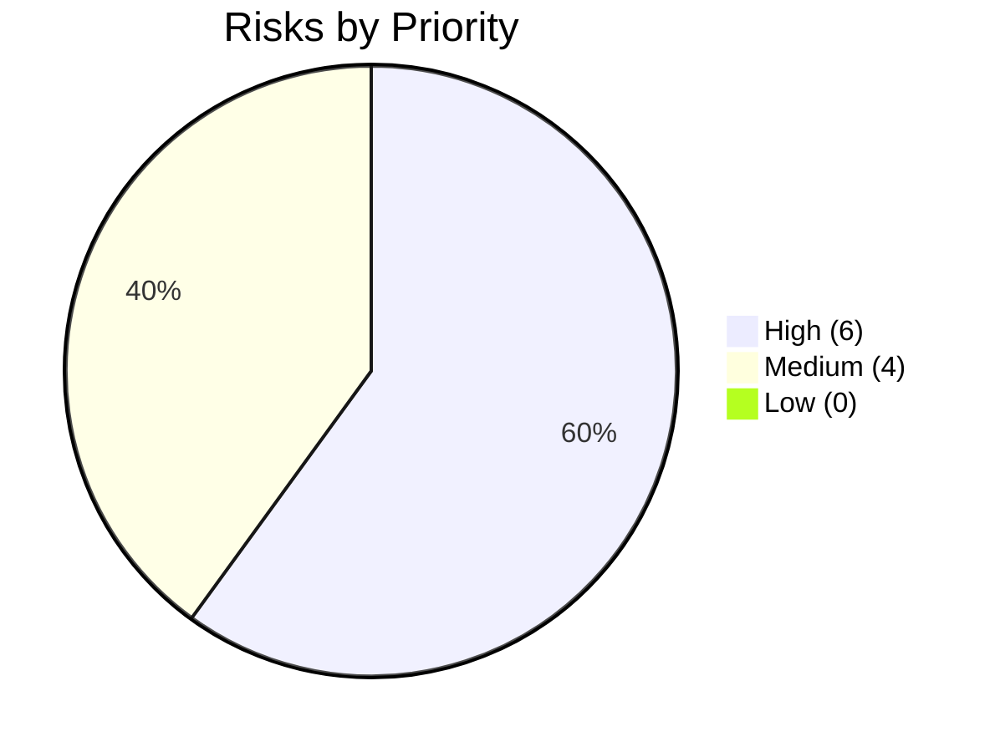
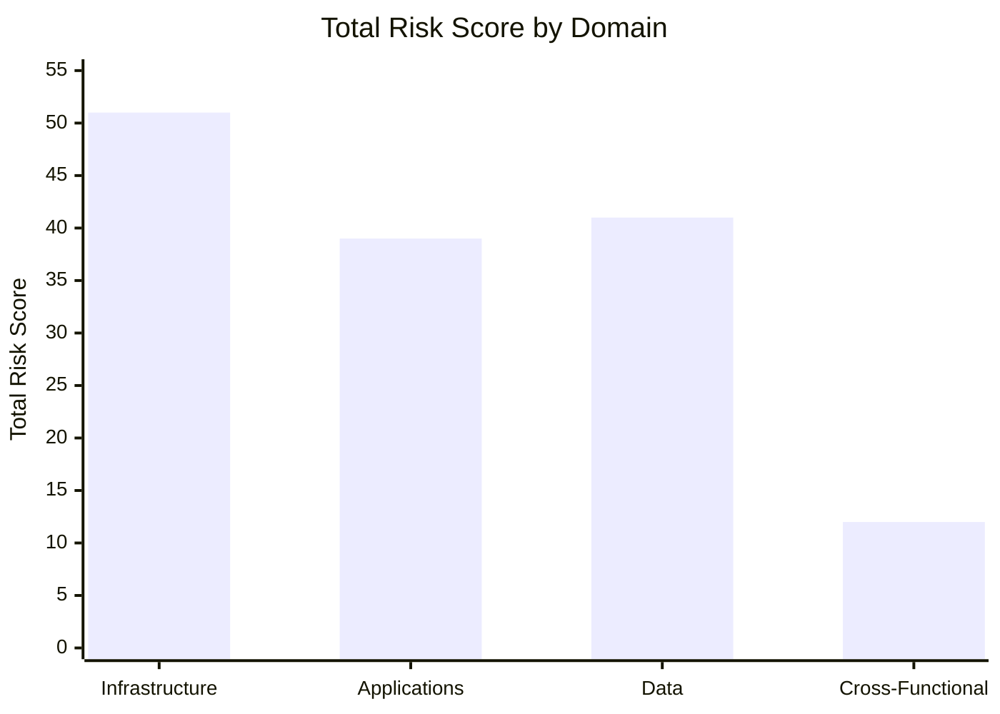
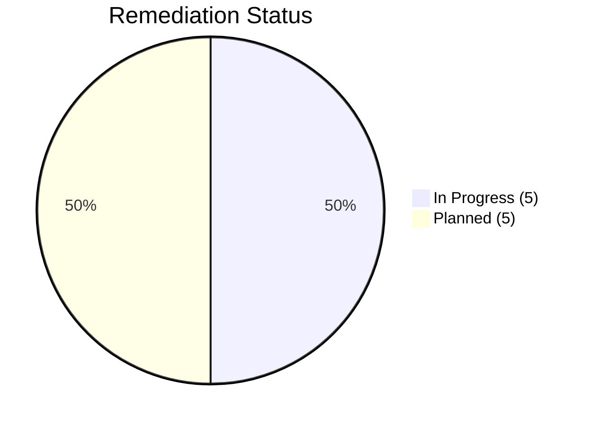

# Cyber Risk Dashboard (Interview View)

This dashboard summarizes the current risk posture from `../risk_register.csv` for quick stakeholder review and interview walkthroughs.

## KPI Snapshot

| KPI | Value |
|---|---:|
| Total Risks | 10 |
| High Priority | 6 |
| Medium Priority | 4 |
| Low Priority | 0 |
| In Progress | 5 |
| Planned | 5 |
| Average Risk Score | 14.3 |
| Highest Risk Score | 20 |

## Priority Distribution

## Risk Concentration by Domain

## Remediation Progress

## Top 5 Risks by Score

| Risk ID | Domain | Risk Score | Priority | Status |
|---|---|---:|---|---|
| R-001 | Infrastructure | 20 | High | In Progress |
| R-002 | Infrastructure | 16 | High | In Progress |
| R-007 | Data | 16 | High | Planned |
| R-003 | Infrastructure | 15 | High | Planned |
| R-005 | Applications | 15 | High | In Progress |

## Interview Talking Track (60-90 seconds)

1. Start with exposure profile: 60% of identified risks are high priority.
2. Show concentration: infrastructure contributes the largest cumulative risk score.
3. Explain execution posture: half of risks are already in progress with named owners and dates.
4. Close with governance alignment: remediation mapped to NIST CSF and SOC 2 controls.

## Data Sources

- `risk_summary.csv`
- `risks_by_priority.csv`
- `risks_by_domain.csv`
- `risks_by_status.csv`
- `../risk_register.csv`
